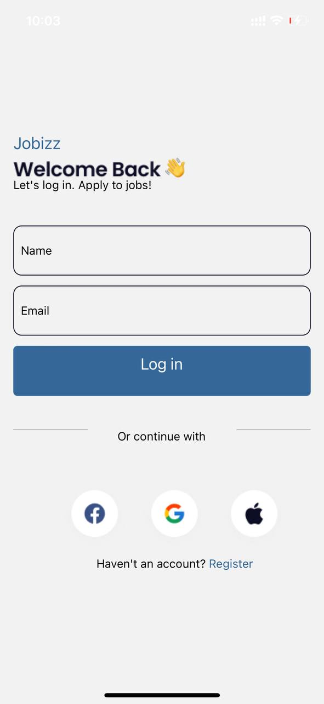

# rn-assignment4-11286009

## DCIT 204 Assignment 4

**ID:** 11286O009

This repository contains the source code for a mobile application developed as part of the DCIT 202 Mobile Application Development course. The application is a task management app, following the design provided in the UI mockup.

## Table of Contents

- [Installation](#installation)
- [Usage](#usage)
- [Components](#components)
- [Screenshots](#screenshots)

## Installation

1. Clone the repository to your local machine:

   ```bash
   git clone https://github.com/Bismark-Darfour/rn-assignment4-11286009.git
   cd rn-assignment4-11286009

## Usage

This application enables users to explore a range of job opportunities. It offers features such as Popular Jobs and Featured Jobs, each listing the job title, location, salary, and company.

## Components

## LoginScreen

**File:** `components/LogInScreen.js`

* **Usage:** Allows the user to login.
* **Props:** None


### HomeScreen

**File:** `components/HomeScreen.js`

* **Usage:** Displays a list of avaiable jobs.
* **Props:** None


## Screenshots

### Login Screen



**Description:** This screenshot shows the Login screen of the application. With this login sceen, user details are stored in states and rendered on the home screen as specified in the instructions


### Home Screen

)

**Description:** This screenshot shows the home screen of the application. It includes the
user details and present jobs available to the user.

